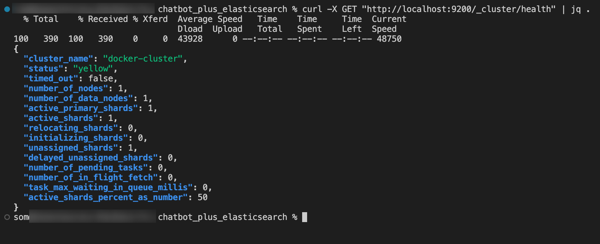
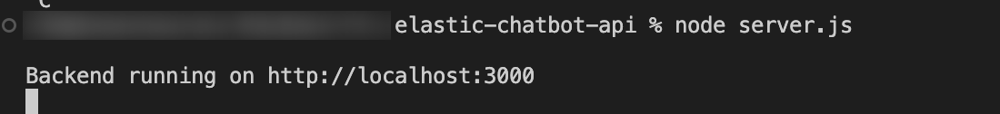
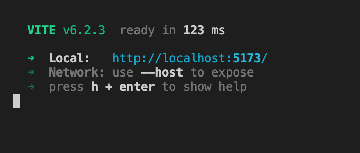
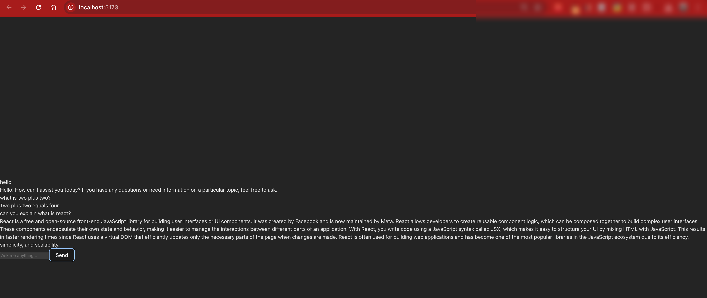
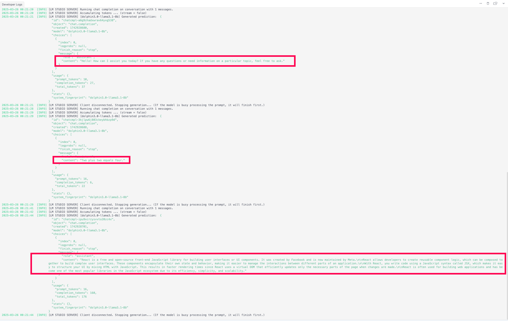
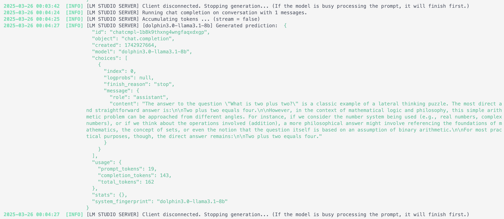

# Chatbot Setup Guide

This guide provides step-by-step instructions to set up a chatbot that integrates with **Elasticsearch** and **LM Studio** using Docker, Node.js, and React.

---

## **Prerequisites**
Ensure you have the following installed:
- [Docker](https://docs.docker.com/get-docker/)
- [Node.js](https://nodejs.org/) (v18+ recommended)
- [LM Studio](https://lmstudio.ai/) (running on `http://localhost:1234`)

---

## **Step 1: Install and Start Elasticsearch using Docker**

```sh
# Pull and run Elasticsearch container
docker run -d --name elasticsearch -p 9200:9200 -e "discovery.type=single-node" -e "xpack.security.enabled=false" elasticsearch:8.11.3
```

### **Verify Elasticsearch is Running**
```sh
curl -X GET "http://localhost:9200/_cat/health?v"
```
Expected output:
```
epoch      timestamp cluster        status node.total node.data shards pri relo init unassign pending_tasks max_task_wait_time active_shards_percent
1742928261 18:44:21  docker-cluster yellow          1         1      1   1    0    0        1             0                  -                 50.0%
```

---

## **Step 2: Create Elasticsearch Index**
Run the following command to create the required `chatbot` index:

```sh
curl -X PUT "http://localhost:9200/chatbot" -H "Content-Type: application/json" -d '
{
  "mappings": {
    "properties": {
      "question": { "type": "text" },
      "answer": { "type": "text" }
    }
  }
}'
```
Otherwise, you can expect an error.
---

## **Step 3: Start LM Studio**
Ensure **LM Studio** is running on `http://localhost:1234` and has a model loaded.

To verify, run:
```sh
curl -X GET "http://localhost:1234/v1/models"
```
You should see a list of available models.

---

## **Step 4: Set Up the Backend (Node.js)**

### **Install Dependencies**
```sh
mkdir chatbot-backend && cd chatbot-backend
npm init -y
npm install express cors dotenv axios @elastic/elasticsearch
```

### **Create `server.js`**
```javascript
require("dotenv").config();
const express = require("express");
const cors = require("cors");
const { Client } = require("@elastic/elasticsearch");
const axios = require("axios");

const app = express();
const PORT = 3000;

app.use(cors());
app.use(express.json());

const esClient = new Client({ node: "http://localhost:9200" });

app.post("/chat", async (req, res) => {
  const userMessage = req.body.message;

  try {
    const { hits } = await esClient.search({
      index: "chatbot",
      query: { match: { question: userMessage } },
    });

    if (hits.hits.length > 0) {
      return res.json({ response: hits.hits[0]._source.answer });
    }
  } catch (error) {
    console.error("Elasticsearch error:", error.message);
  }

  try {
    const lmResponse = await axios.post(
      "http://localhost:1234/v1/chat/completions",
      {
        model: "dolphin3.0-llama3.1-8b",
        messages: [{ role: "user", content: userMessage }],
        temperature: 0.7,
        max_tokens: -1,
        stream: false,
      },
      { headers: { "Content-Type": "application/json" } }
    );

    return res.json({ response: lmResponse.data.choices[0].message.content });
  } catch (error) {
    console.error("LM Studio error:", error.message);
    return res.status(500).json({ response: "Error fetching response from LM Studio" });
  }
});

app.listen(PORT, () => console.log(`Backend running on http://localhost:${PORT}`));
```

### **Run the Backend**
```sh
node server.js
```

---

## **Step 5: Set Up the Frontend (React)**

### **Install Dependencies**
```sh
npx create-vite chatbot-ui --template react
cd chatbot-ui
npm install axios
```

### **Update `Chatbot.jsx`**
```javascript
import { useState } from "react";
import axios from "axios";

export default function Chatbot() {
  const [messages, setMessages] = useState([]);
  const [input, setInput] = useState("");

  const sendMessage = async () => {
    if (!input.trim()) return;
    const userMessage = { sender: "user", text: input };
    setMessages([...messages, userMessage]);
    setInput("");

    try {
      const response = await axios.post("http://localhost:3000/chat", { message: input });
      const botMessage = { sender: "bot", text: response.data.response };
      setMessages((prev) => [...prev, botMessage]);
    } catch (error) {
      setMessages((prev) => [...prev, { sender: "bot", text: "Error fetching response" }]);
    }
  };

  return (
    <div className="flex flex-col w-full max-w-md mx-auto p-4 bg-gray-100 rounded-xl shadow-lg">
      <div className="h-80 overflow-y-auto mb-4 p-2 bg-white rounded-lg">
        {messages.map((msg, index) => (
          <div key={index} className={`p-2 my-1 rounded-lg ${msg.sender === "user" ? "bg-blue-500 text-white self-end" : "bg-gray-300 text-black self-start"}`}>
            {msg.text}
          </div>
        ))}
      </div>
      <div className="flex gap-2">
        <input type="text" value={input} onChange={(e) => setInput(e.target.value)} placeholder="Ask me anything..." className="flex-1 p-2 border rounded-lg" />
        <button onClick={sendMessage} className="bg-blue-500 text-white p-2 rounded-lg">Send</button>
      </div>
    </div>
  );
}
```

### **Run the Frontend**
```sh
npm run dev
```



---

## **Final Step: Test the Chatbot**
- Open **http://localhost:5173** in your browser.
- Ask a question!







✅ If the response is found in **Elasticsearch**, it returns that answer.
✅ If not, it queries **LM Studio** for a response.

🚀 **Your chatbot is now fully functional!**

